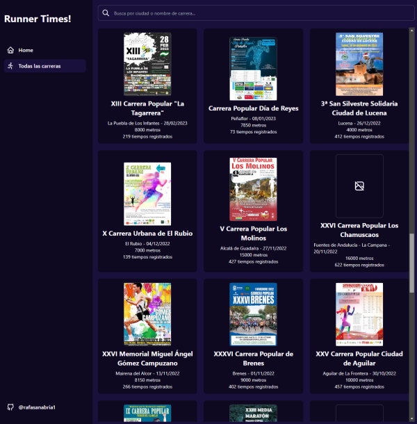
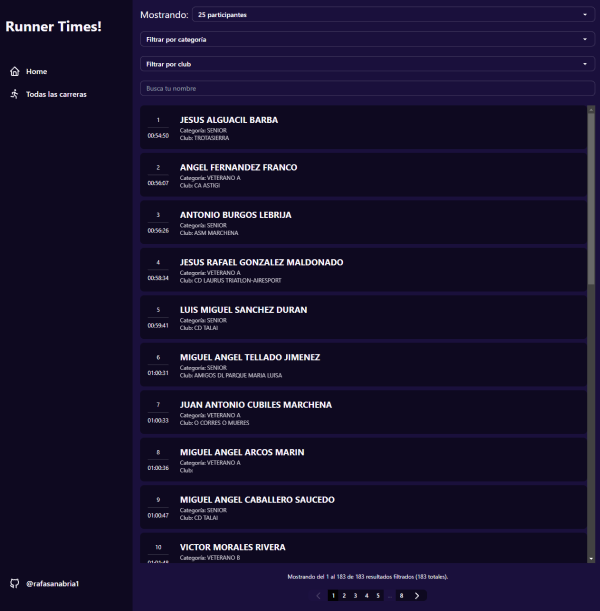
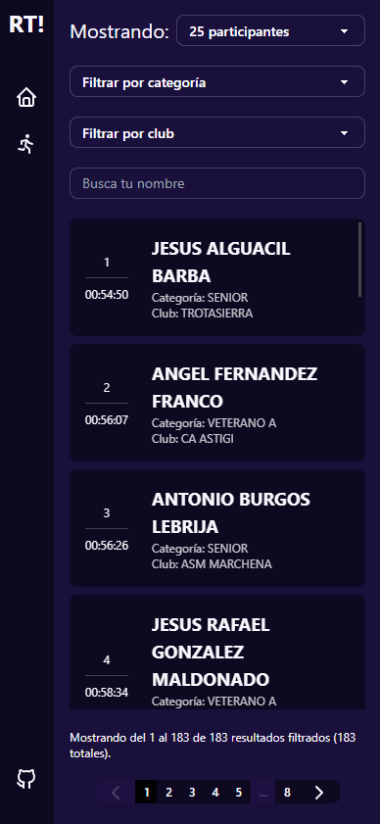

# Runner times

## Descripción

Este repositorio contiene una aplicación comprobar la información y resultados de carreras populares. Actualmente, la información y los resultados publicados son los mismos que están disponibles en [https://www.ideain.com/](https://www.ideain.com/) y han sido obtenidos mediante el proyecto complementario [https://github.com/rafasanabria1/scrapping-runner-times](Scrap Runner Times). Ambos proyectos se han realizado solamente con el objetivo de aprendizaje sobre los lenguajes y las platarformas utilizadas.

## Sitio público

Puedes ver este proyecto desplegado en [https://runner-times.vercel.app/](https://runner-times.vercel.app/), o puedes instalarlo y probarlo en tu entorno local siguiendo las instrucciones de instalación.

## Tecnologías utilizadas

- [NextJS](https://nextjs.org/)
- [TailwindCSS](https://tailwindcss.com/)
- [Prisma](https://supabase.com/)
- [MongoDB](https://www.mongodb.com/)

## Tareas en desarrollo
- Implementar métricas de seguimiento de vercel.
- Implementar SEO.
- Implementar la posibilidad de cambiar entre tema claro y oscuro.
- Agregar tiempos desde otras webs de cronometraje.

## Imágenes de la aplicación en versión escritorio
<p align="center">
  
</p>
<p align="center">
  
</p>

## Imágenes de la aplicación en versión móvil
<p align="center">
  
  
</p>

## Instalación

1. Clona este repositorio:
   `git clone https://github.com/rafasanabria1/runner-times.git`

2. Navega a la carpeta del proyecto:
   `cd runner-times`

3. Configura las variables de entorno necesarias creando en el archivo `env.local` o editando el archivo `.env` (será necesario una cuenta en [MongoDB Atlas](https://www.mongodb.com/atlas/database)):
    ```
      DATABASE_NAME=your-database-name
      DATABASE_USER=your-database-user
      DATABASE_PASSWORD=your-databse-password
    ```

4. Instala las dependencias:
   `npm install`

5. Ejecuta el proyecto:
   `npm run dev`

Visita `http://localhost:3000` en tu navegador para ver la aplicación en funcionamiento.
